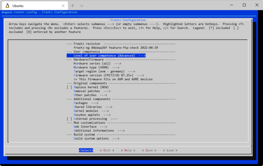
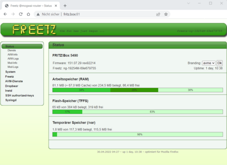

```
 _____              _            _   _  ____
|  ___| __ ___  ___| |_ ____    | \ | |/ ___|
| |_ | '__/ _ \/ _ \ __|_  /____|  \| | |  _
|  _|| | |  __/  __/ |_ / /_____| |\  | |_| |
|_|  |_|  \___|\___|\__/___|    |_| \_|\____|

Freetz-NG firmware modification for ​AVM devices like FRITZ!
```
>  **Freetz-NG is a fork of Freetz.**  
>  **More features - less bugs!**

[![stable-release-shields.io-url][stable-release-shields.io-url]][stable-release-github-url] 
[![github-page-shields.io-url][github-page-shields.io-url]][github-page-github.io-url] 
[![gloc-shields.io-url][gloc-shields.io-url]][gloc-github-url] 
[![license-shields.io-url][license-shields.io-url]][license-github-url] 

[stable-release-shields.io-url]: https://img.shields.io/badge/release-ng22040-brightgreen
[stable-release-github-url]: https://github.com/Freetz-NG/freetz-ng/releases/tag/ng22040
[github-page-shields.io-url]: https://img.shields.io/badge/doc-freetz--ng.github.io-blue
[github-page-github.io-url]: https://freetz-ng.github.io/freetz-ng
[gloc-shields.io-url]: https://img.shields.io/badge/gloc-1.8m-blue
[gloc-github-url]: https://github.com/kas-elvirov/gloc
[license-shields.io-url]: https://img.shields.io/badge/license-GPL--2.0-blue
[license-github-url]: https://github.com/Freetz-NG/freetz-ng/blob/master/LICENSE


## Table of Contents

1. [About](#about)
2. [Installation](#installation)
3. [Freetz: Web Interface](#freetz-web-interface) 
4. [Developer Documentation](#developer-documentation)
5. [Git Essentials](#git-essentials)
6. [Mirrors](#mirrors)

### About

Freetz is a toolbox for developers and experienced users to build a functionally modified firmware for various DSL/LAN/WLAN/VoIP routers of the AVM Fritz!Box or T-Com Speedport 
series (similar in construction) and transfer it to the device. A variety of extension packages are offered, but also possibilities to remove unneeded functionality of the original firmware.

### Installation

**Requirements**
 * You need an up to date Linux System with some [prerequisites](docs/PREREQUISITES.md).
 * Or download a ready-to-use VM like Gismotro's [Freetz-Linux](https://freetz.digital-eliteboard.com/?dir=Teamserver/Freetz/Freetz-VM/VirtualBox/). (admin & pass: freetz)
 * Your linux user needs to have set `umask 0022` before checkout and during make.

**Clone the master branch**
```
  git clone https://github.com/Freetz-NG/freetz-ng ~/freetz-ng
```

... or clone a single [tag](../../tags):

```
  git clone https://github.com/Freetz-NG/freetz-ng ~/freetz-ng --single-branch --branch TAGNAME
```

**Build firmware**
```
  cd ~/freetz-ng
  make menuconfig
  make
  # make help
```

<figure>
	<a href="docs/screenshots/282.png">   
		
	</a>
	<br>
	<figcaption><b>Figure 1</b>: Freetz configuration dialog from <i>make menuconfig</i> (Source: Zaugg S., 2022)</figcaption>
</figure>

**Flash firmware**
```
  # make push-firmware
  tools/push_firmware -h
```

### Freetz: Web Interface

Modded firmware contains an customized web interface on `http port 81`:  

<figure>
	<a href="docs/screenshots/281.png">   
		
	</a>
	<br>
	<figcaption><b>Figure 2</b>: Freetz Web Interface on http port 81 (Source: Zaugg S., 2022)</figcaption>
</figure>

Note: The original web interface is still accessible on `http port 80`

### Developer Documentation

Official Github Page: <a href="https://freetz-ng.github.io" target="_blank" rel="noopener noreferrer">https://freetz-ng.github.io</a> 

### Git Essentials

Git cheat sheet: <a href="https://doabledanny.gumroad.com/l/git-commands-cheat-sheet-pdf" target="_blank" rel="noopener noreferrer">Download PDF</a>  

**Clone master branch with all git submodules**
```
  git clone --recurse-submodules https://github.com/Freetz-NG/freetz-ng
```

**Show GIT states**
```
  git status
  git diff --no-prefix # --cached # > file.patch
  git log --graph # --oneline
```

**Delete local changes**
```
  git checkout master ; git fetch --all --prune ; git reset --hard origin/HEAD ; git clean -fd
```

**Checkout old revision**
```
  git checkout HASH-OF-COMMIT # -b NEW-BRANCH
```

### Mirrors

* <a href="https://gitlab.com/Freetz-NG/freetz-ng" target="_blank" rel="noopener noreferrer">gitlab</a>  
* <a href="https://bitbucket.org/Freetz-NG/freetz-ng" target="_blank" rel="noopener noreferrer">bitbucket</a>  
* <a href="https://svn.boxmatrix.info/freetz-ng/trunk" target="_blank" rel="noopener noreferrer">subversion</a>  